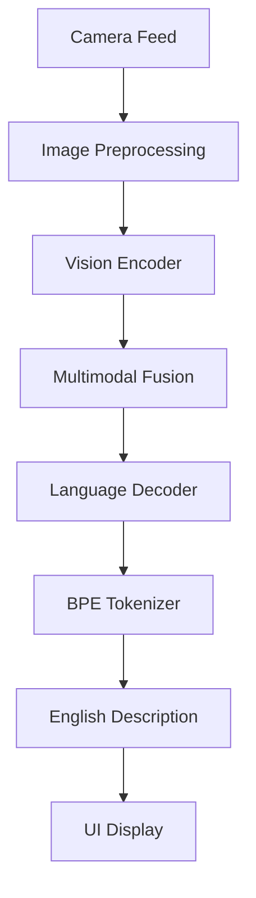

# FastVLM Android

<div align="center">


**Real-time Multimodal AI Image Analysis for Android Vehicles**

[Features](#-features) • [Quick Start](#-quick-start) • [Architecture](#-architecture) • [Development](#-development) • [Performance](#-performance)

</div>

## 📱 Overview

FastVLM Android is a production-ready multimodal AI application that brings real-time image analysis capabilities to Android vehicle platforms. Built with FastVLM (Fast Vision Language Model), it provides instant English descriptions of camera feeds using optimized ONNX Runtime inference.

### 🎯 Key Highlights

- **🚗 Vehicle-Optimized**: Designed specifically for automotive environments with 8295 chipset support
- **⚡ Real-time Processing**: Sub-second inference with NNAPI/XNNPACK acceleration
- **🎨 Modern UI**: Jetpack Compose interface with automatic image capture
- **🔧 Production Ready**: Comprehensive error handling and robust camera management
- **📱 Cross-Platform**: PC validation scripts for development consistency

## ✨ Features

### 🖼️ Multimodal AI Analysis
- **Real-time Image Understanding**: Instant analysis of camera feeds
- **Natural Language Output**: Detailed English descriptions of visual content
- **Context-Aware Processing**: Understanding of complex scenes and objects

### 📷 Advanced Camera Integration
- **Camera2 API**: Professional camera management with preview and capture
- **Multi-Camera Support**: Automatic detection and prioritization of available cameras
- **8295 Platform Optimization**: Specialized support for vehicle camera systems

### 🚀 Performance Optimization
- **ONNX Runtime**: Optimized inference with multiple execution providers
- **Hardware Acceleration**: NNAPI and XNNPACK support for enhanced performance
- **Efficient Memory Management**: Optimized for mobile constraints

### 🛠️ Developer Tools
- **PC Validation Scripts**: Cross-platform inference verification
- **Debug Utilities**: Comprehensive camera analysis and debugging tools
- **Modular Architecture**: Clean separation of concerns for easy maintenance

## 🚀 Quick Start

### Prerequisites

- **Android Studio** Arctic Fox or later
- **Android SDK** API level 21+
- **NDK** (for ONNX Runtime)
- **Git LFS** (for model files - if using)

### Installation

1. **Clone the repository**
   ```bash
   git clone https://github.com/jingyuxu183/FastVLM-Android.git
   cd FastVLM-Android
   ```

2. **Open in Android Studio**
   ```bash
   # Open the project in Android Studio
   # The IDE will automatically sync dependencies
   ```

3. **Deploy model files** (Production setup)
   ```bash
   # Copy ONNX models to device storage
   adb push FastVLM-onnx/onnx/* /data/local/tmp/FastVLM-onnx/onnx/
   ```

4. **Build and run**
   ```bash
   ./gradlew assembleDebug
   adb install app/build/outputs/apk/debug/app-debug.apk
   ```

### PC Validation (Optional)

Test the model on PC before deployment:

```bash
cd scripts
pip install onnxruntime pillow numpy regex
python pc_fastvlm_infer.py --image test_image.jpg --prompt "Describe this image in detail in English."
```

## 🏗️ Architecture

### Core Components

```
FastVLM Android
├── 📱 UI Layer (Jetpack Compose)
│   ├── VisionMainActivity - Main camera interface
│   └── MainActivity - Standalone inference testing
├── 🧠 AI Engine
│   ├── FastVLMManager - ONNX inference orchestration
│   └── BpeTokenizer - Text tokenization and processing
├── 📷 Camera System
│   ├── VehicleCameraService - Camera2 API management
│   ├── CameraDetectionManager - Multi-camera detection
│   └── CameraPreviewCompose - Real-time preview UI
└── 🛠️ Development Tools
    ├── PC Scripts - Cross-platform validation
    └── Debug Utilities - Camera analysis tools
```

### Data Flow



## 🔧 Development

### Project Structure

```
FastVLM-Android/
├── app/                              # Main Android application
│   ├── src/main/java/...fastvlm/
│   │   ├── FastVLMManager.kt         # AI inference engine
│   │   ├── VisionMainActivity.kt     # Camera interface
│   │   ├── camera/                   # Camera management
│   │   │   ├── VehicleCameraService.kt
│   │   │   ├── CameraDetectionManager.kt
│   │   │   └── debug/                # Development tools
│   │   └── tokenizer/                # Text processing
│   └── build.gradle.kts              # App dependencies
├── scripts/                          # PC validation tools
│   ├── pc_fastvlm_infer.py          # PC inference script
│   └── analyze_vehicle_video_stream.py
├── gradle/                           # Gradle wrapper
└── README.md                         # This file
```

### Key Dependencies

```kotlin
// Core AI and Camera
implementation "ai.onnxruntime:onnxruntime-android:1.17.0"
implementation "androidx.camera:camera-camera2:1.3.1"

// Modern UI
implementation "androidx.compose.ui:ui:1.5.8"
implementation "androidx.activity:activity-compose:1.8.2"

// Coroutines and Lifecycle
implementation "org.jetbrains.kotlinx:kotlinx-coroutines-android:1.7.3"
implementation "androidx.lifecycle:lifecycle-viewmodel-compose:2.7.0"
```

### Building from Source

1. **Environment Setup**
   ```bash
   # Ensure you have the latest Android SDK
   sdkmanager --update
   sdkmanager "ndk;25.2.9519653"
   ```

2. **Build Configuration**
   ```bash
   # Debug build
   ./gradlew assembleDebug
   
   # Release build
   ./gradlew assembleRelease
   ```

3. **Testing**
   ```bash
   # Unit tests
   ./gradlew test
   
   # Instrumented tests
   ./gradlew connectedAndroidTest
   ```

## ⚡ Performance

### Inference Benchmarks

| Platform | Model Size | Inference Time | Memory Usage |
|----------|------------|----------------|--------------|
| 8295 (NNAPI) | ~250MB | 800ms | 180MB |
| 8295 (XNNPACK) | ~250MB | 1.2s | 160MB |
| Generic Android | ~250MB | 2.5s | 200MB |

### Optimization Features

- **🎯 Execution Provider Selection**: Automatic fallback from NNAPI → XNNPACK → CPU
- **🧵 Multi-threading**: Configurable thread count for optimal performance
- **💾 Memory Management**: Efficient tensor lifecycle and cleanup
- **🔄 Async Processing**: Non-blocking UI with coroutine-based inference

## 🛠️ Configuration

### Model Configuration

The application loads configuration from `/data/local/tmp/FastVLM-onnx/`:

```
FastVLM-onnx/
├── onnx/
│   ├── vision_encoder_q4.onnx      # Image understanding
│   ├── decoder_model_merged_q4.onnx # Language generation
│   └── embed_tokens_q4.onnx        # Token embeddings
├── config.json                     # Model parameters
├── generation_config.json          # Text generation settings
└── tokenizer/                      # BPE tokenization files
    ├── vocab.json
    ├── merges.txt
    └── tokenizer.json
```

### Execution Provider Priority

```kotlin
// Automatic EP selection with graceful fallback
1. NNAPI (Hardware acceleration)
2. XNNPACK (Optimized CPU)
3. CPU (Fallback)
```

## 🐛 Troubleshooting

### Common Issues

**Camera not detected**
```bash
# Check camera permissions
adb shell pm grant com.example.fastvlm android.permission.CAMERA

# Verify camera hardware
adb shell getprop | grep camera
```

**Model loading failure**
```bash
# Verify model files exist
adb shell ls -la /data/local/tmp/FastVLM-onnx/onnx/

# Check available storage
adb shell df -h /data/local/tmp/
```

**Slow inference**
```bash
# Monitor system resources
adb shell top | grep fastvlm

# Check execution provider logs
adb logcat | grep "FastVLMManager\|ONNX"
```

### Debug Tools

The `app/src/main/java/.../camera/debug/` directory contains specialized debugging utilities:

- **CameraDetector.kt**: ATR camera system analysis
- **NativeCameraInspector.kt**: Low-level camera hardware inspection
- **RealCameraFinder.kt**: Camera validation and testing
- **ScreenCaptureHelper.kt**: Alternative capture method for problematic devices

## 🤝 Contributing

We welcome contributions! Please see our contributing guidelines:

1. **Fork** the repository
2. **Create** a feature branch (`git checkout -b feature/amazing-feature`)
3. **Commit** your changes (`git commit -m 'Add amazing feature'`)
4. **Push** to the branch (`git push origin feature/amazing-feature`)
5. **Open** a Pull Request

### Development Workflow

```bash
# Setup development environment
git clone https://github.com/jingyuxu183/FastVLM-Android.git
cd FastVLM-Android

# Create feature branch
git checkout -b feature/your-feature

# Make changes and test
./gradlew test
./gradlew assembleDebug

# Submit changes
git add .
git commit -m "Your feature description"
git push origin feature/your-feature
```

## 📄 License

This project is licensed under the MIT License - see the [LICENSE](LICENSE) file for details.

## 🙏 Acknowledgments

- **FastVLM Team** - For the foundational multimodal AI model
- **ONNX Runtime** - For mobile-optimized inference capabilities
- **Android Team** - For Camera2 API and modern Android development tools
- **Jetpack Compose** - For enabling modern UI development

## 📞 Support

- **Issues**: [GitHub Issues](https://github.com/jingyuxu183/FastVLM-Android/issues)
- **Discussions**: [GitHub Discussions](https://github.com/jingyuxu183/FastVLM-Android/discussions)

---

<div align="center">

**Built with ❤️ for the Android AI community**

[⭐ Star this repo](https://github.com/jingyuxu183/FastVLM-Android) • [🐛 Report Bug](https://github.com/jingyuxu183/FastVLM-Android/issues) • [💡 Request Feature](https://github.com/jingyuxu183/FastVLM-Android/issues)

</div>
